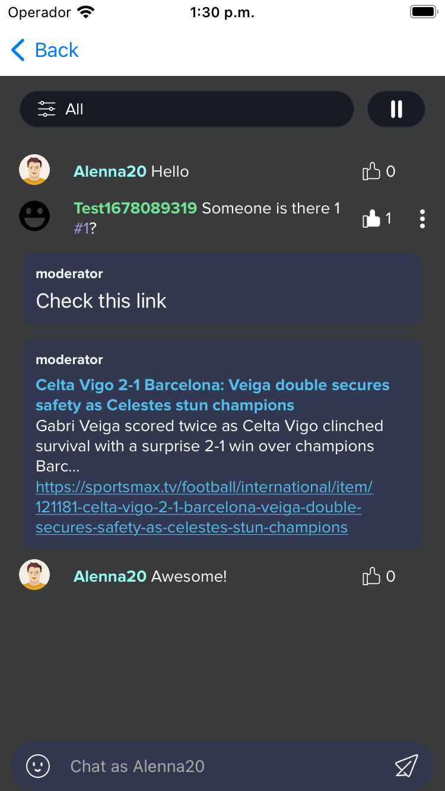
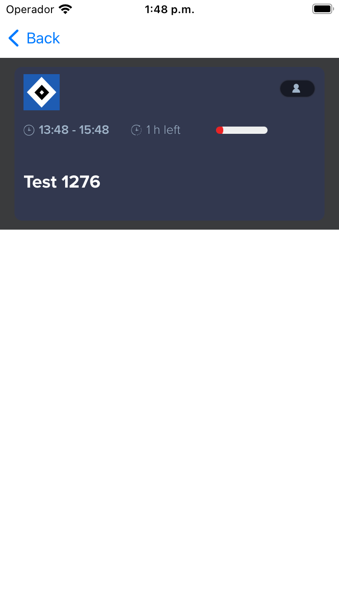
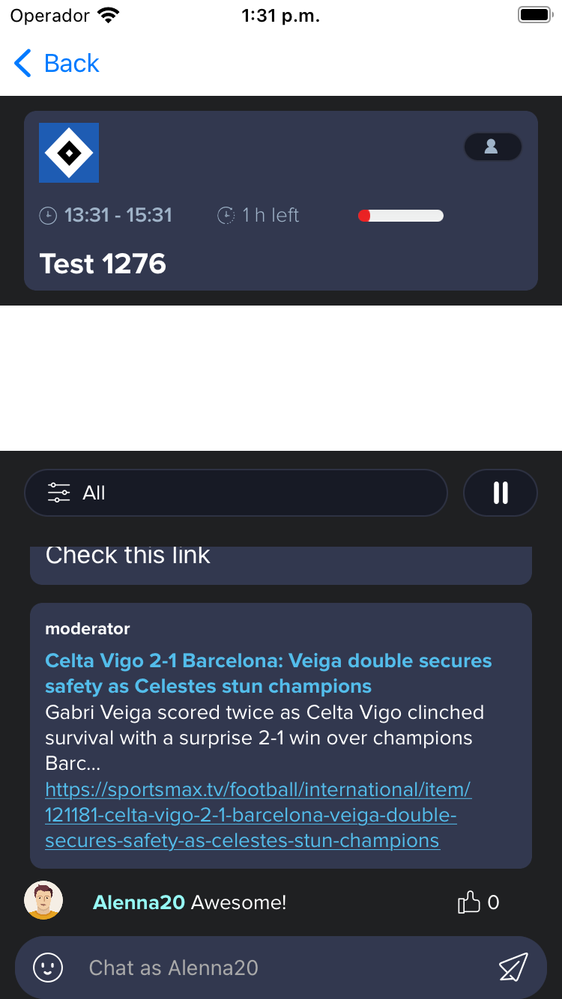
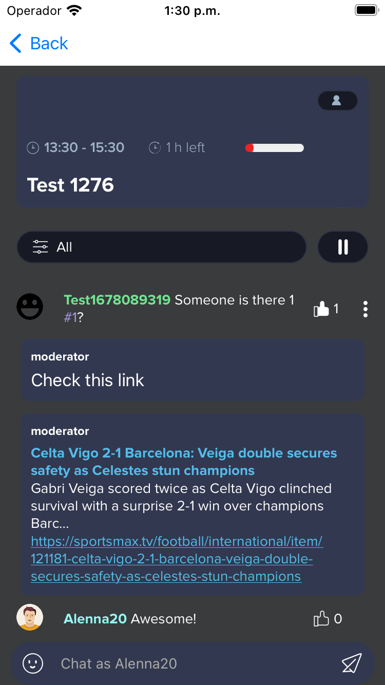
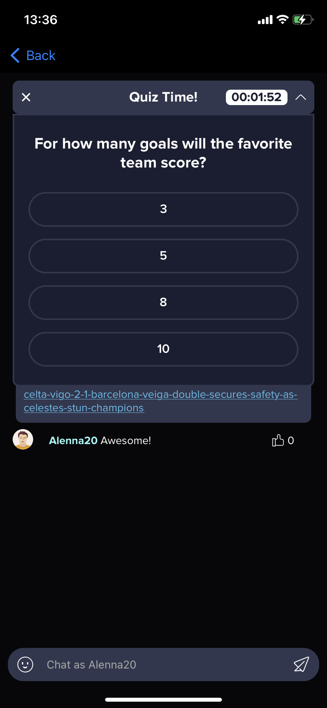
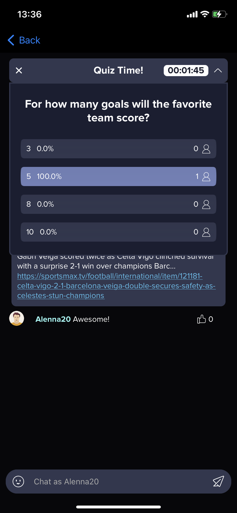
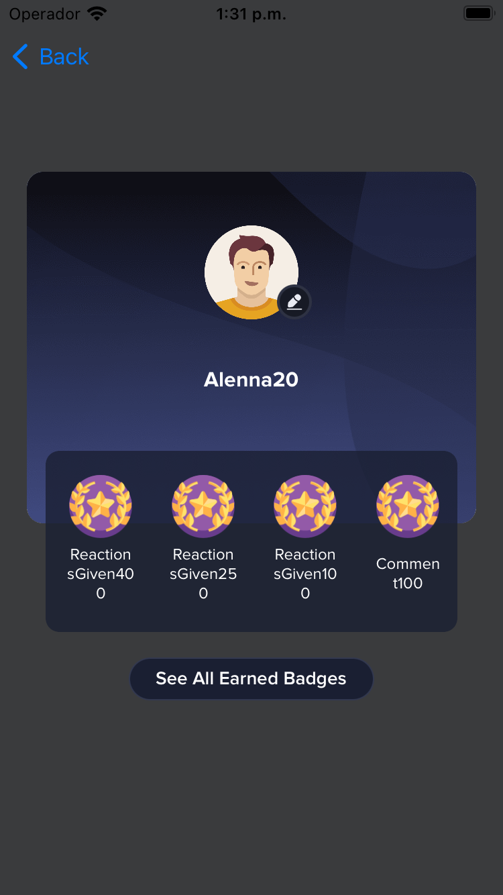
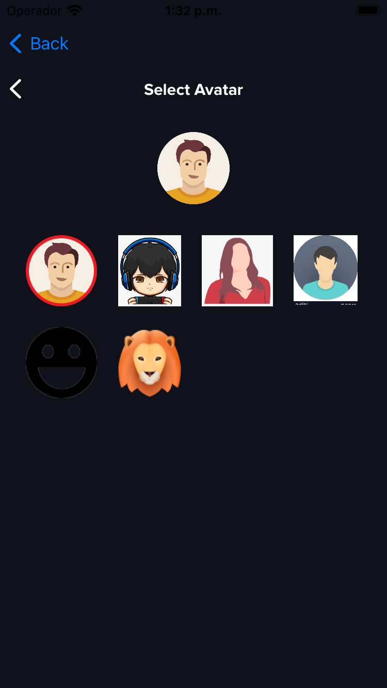
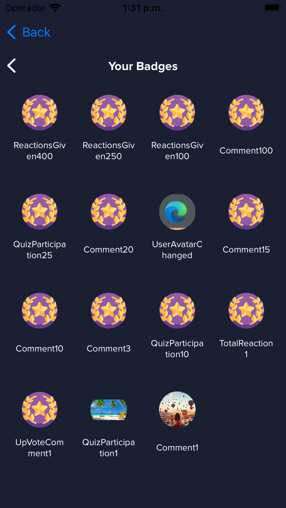

# Saytv Chat Example iOS
App that is going to use the Saytv Chat library.

Table of contents
- [What's New](#whats-new) 
- [Requirements](#requirements) 
- [Instalation](#chat-sdk)
- [Initialization](#initialization)
- [Push notifications](#push-notifications)
- [Register, login and logout](#register-login-and-logout)
- [Chat](#chat)
- [Header](#header)
- [Get active users](#get-active-users)
- [Dummy header](#dummy-header)
- [Full Chat](#full-chat)
- [Profile](#profile)
- [Options](#options)
- [Known Issues](#known-issues)

## What's New
### 13.0.2
- Remove ads with end time
- Hide ads when showing the quiz
- Resize header ads and UI/UX behaviour

Check older versions on the [CHANGELOG](CHANGELOG.md)

## Images










## Requirements
To utilize the library, it is essential to obtain a key that grants access to the repository. This requirement ensures secure and controlled distribution of the library within our organization. The key serves as an authentication mechanism, allowing authorized personnel to download the library from the repository.

To request a key, please follow the steps outlined below:

1. Contact the designated administrator or the responsible team within our organization to initiate the key request process.

2. Provide the necessary information, including your name, role, and purpose for accessing the library. Explain how the library will be utilized within your projects or applications.

Once you have obtained the key, you can use it to access and download the library from the repository. Follow the instructions provided by the administrator or refer to the documentation for details on how to authenticate and utilize the key for repository access.

Note: The key is a valuable asset and should be handled with care. It is important to abide by the organization's policies and ensure that the key is used solely for the intended purposes.

By following these steps and obtaining the necessary key, you will be able to download and integrate the library into your projects, thereby leveraging its functionality to enhance your software development process.

If you encounter any issues during the key request process or require further assistance, please reach out to the designated administrator or the responsible team for prompt support.

## Chat SDK

The Chat SDK is available on Swift Package Manager (SPM), to use it we are going to need to follow the next steps:

1. Add a package by selecting `File` → `Add Packages…` in Xcode’s menu bar.

2. Search for the SaytvChat Apple SDK using the repo's URL:
```console
https://davidgarcia93@bitbucket.org/square1/saytv_sdk_ios.git
```

3. Next, set the **Dependency Rule** to be `Up to Next Major Version` and specify `2.0.0` as the lower bound.

4. Then, select **Add Package**.

5. Choose the `SaytvChat` on the list of the products and click **Add Package**

6. The SDK is private so you are going to need a password (That Square1 is going to send you) to download and add it to the project

7. Use this import on every file you want to use the pod
```swift
import SaytvChat
```

## Initialization
To initialise SDK simply call `SayTvSdk.initialise(appName: "APP_NAME", environment: .production)`on your app start in AppDelegate or before using any of the SDK component.
App name will be used mainly in the chat component to replace app name in the messages displayed to the user (e.g. welcome message on empty chat).

You can initialize SDK with a custom base url call instead the default one `SayTvSdk.initialise(appName: "APP_NAME", baseUrl: "https:www.google.com")`

To enable logging mechanism use `SayTvSdk.setLogOption(.verbose)` to see all logs related with Saytv SDK before initializing any of the SDK component, preferably in AppDelegate just before `SayTvSdk.initialise` method.

## Push notifications
The class that handles all the push notification behavior is `PushComponent`. We assume you already have the **push configured**.

You need to instantiate the class and use the next methods in the **AppDelegate.swift**:

```swift
private let pushComponent = PushComponent()
```

- At the beginning of the `applicationDidReceiveRemoteNotification`, add the `.handlePush(response:_)` to filter the messages that the SDK is going to handle

```swift
func application(_ application: UIApplication,
                 didReceiveRemoteNotification userInfo: [AnyHashable : Any],
                 fetchCompletionHandler completionHandler: @escaping (UIBackgroundFetchResult) -> Void) {
    if pushComponent.handlePush(response: userInfo) {
        completionHandler(.noData)
        return
    }
    // your code...
}
```

- Using the `MessagingDelegate`, in the `didReceiveRegistrationToken` function, add the `.saveToken(_ fcmToken: _)` to save and use the token in the SDK

```swift
func messaging(_ messaging: Messaging, 
               didReceiveRegistrationToken fcmToken: String?) {
    pushComponent.saveToken(fcmToken ?? "")
}
```

## Register, login and logout

### Register

To register inside the SDK you just need to add `SayTvSadk.register(digicelId:_, email:_, avatar:_, username:_, apiToken:_, completion: _)` where the **completion** is going to have the service call response.

```swift
SayTvSdk.register(digicelId: 12,
                  avatar: "https://lorempixel.com/avatar.png",
                  username: "davidtwo", 
                  apiToken: "XXXXXXXXXXXXXXXXXXXX") { result in
    switch result {
    case .success(let response):
        print(response)
    case .failure(let errors):
        print(errors.localizedDescription)
        errors.forEach { error in
            switch error {
            case GeneralError.usernameIsRequired:
                print("SDK register failed with error: \(error)")
            case GeneralError.usernameHasAlreadyBeenTaken:
                print("SDK register failed with error: \(error)")
            case GeneralError.digicelIdIsRequired:
                print("SDK register failed with error: \(error)")
            case GeneralError.digicelIdHasAlreadyBeenTaken:
                print("SDK register failed with error: \(error)")
            case GeneralError.fcmTokenIsEmpty:
                print("SDK register failed with error: \(error)")
            default:
                print(error)
            }
        }
    }
}
```

### Login

> You must be registered before try to use the login

To login inside the SDK, you just need to add `SayTvSdk.login(digicelId:_, apiToken:_, completion: _)` where the completion is going to have the service call response

```swift
SayTvSdk.login(digicelId: digicelId, 
               apiToken: "XXXXXXXXXXXXXXXXXXXX") { result in
    switch result {
    case .success(let response):
        print(response)
    case .failure(let error):
        print(error.localizedDescription)
    }
}
```

### Update

> You must be logged in before try to use the update

To update user information inside the SDK, add `updateUser(avatar: _, username: _, completion: _)` where the completion is going to have the service call response:

```swift
SayTvSdk.updateUser(avatar: "https://image.com",
                    username: "davidtwo") { result in
    switch result {
    case .success(let response):
        print(response)
    case .failure(let errors):
        print(errors.localizedDescription)
        errors.forEach { error in
            switch error {
            case GeneralError.usernameIsRequired:
                print("Fail update user: \(error)")
            case GeneralError.usernameHasAlreadyBeenTaken:
                print("Fail update user: \(error)")
            default:
                print(error)
            }
        }
    }
}
```

### Logout

To logout inside the SDK, you just need to add `SayTvSdk.logoutUser(completion: _)` where the completion is going to have the service call response

```swift
SayTvSdk.logoutUser { result in
    switch result {
    case .success(let message):
        print(message)
    case .failure(let error):
        print(error.localizedDescription)
    }
}
```

## Chat
> You must be registered or logged in before trying to use chat.

You are going to need to place an **UIView** anywhere you want on your screen, that will work as a container for the Chat that is going to show the chat screen, Once you have the **UIView** ready, you will have to call the `ChatComponent(`***view***`: _, name: _, image: _, startTime: _, endTime: _, `***chatId***`: _, theme: _, configuration: _, language: _, chatCustomText: _, completion: _)`, where the ***view*** is the UIView that is configured in your screen, the others parameters are optional except for the ***chatId*** that you need to subscribe to the chat. The start time must be a date after or equal to now to work properly.

```swift 
class ChatViewController: UIViewController {

    @IBOutlet weak var containerView: UIView!
    ...

    func startChat() {
        let name = "Nice episode event chat"
        let image = "https://image_url_example.com"
        let startTime = dateFormatter.date(from: "24/05/2022 10:05:00")
        let endTime = dateFormatter.date(from: "26/05/2022 18:00:00")
        let theme = ChatTheme(
            chatText: .red,
            chatTextPlaceholder: .orange,
            chatTextBackground: .green,
            hashtagText: .green,
            chatBackground: .darkGray,
            eventBackground: .cyan,
            chatTextBorder: .blue,
            commentRowBackgroundColor: .orange,
            allOptionsButtonTheme: chatOptionButtonTheme,
            playPauseButtonTheme: chatOptionButtonTheme,
            pictureOptionButtonTheme: chatOptionButtonTheme,
            newQuizButtonTheme: chatOptionButtonTheme,
            hashtagOptionButtonTheme: chatOptionButtonTheme,
            quizTheme: quizTheme,
            moderatorMessageTheme: moderatorMessageTheme,
            loading: .white,
            filterBackgroundColor: UIColor = .gray,
            filterSelectedColor: UIColor = .blue,
            rulesBackgroundColor: .cyan,
            rulesTextColor: .blue,
            rulesButtonColor: .yellow,
            rulesButtonTextColor: .red,
            rulesBorderColor: .brown,
            previewTheme: previewTheme,
            userJoinedBackground: .blue,
            nextChatButtonTheme: .redTheme,
            activeQuizTheme: activeQuizTheme
        )
        let configuration = ChatConfiguration(
            alignTextMessageLeft: false, 
            displayButtonBar: true,
            isFanzone: false,
            shouldDisplayQuizzes: true
        )
        let chatCustomText = ChatCustomText(
            nextChat: "Finish chat",
            chatHasEndedMessage: "Text description"
        )
        let _ = ChatComponent(
            view: containerView,
            name: name,
            image: image,
            startTime: startTime,
            endTime: endTime,
            chatId: chatId,
            theme: theme, 
            configuration: configuration,
            language: .english, 
            chatCustomText: chatCustomText
        ) { result in
            switch result {
            case .success:
                print("Chat Success")
            case .failure(let error):
                print(error.localizedDescription)
            }
        }
    }

    ...
}
```

When initialising a chat component SDK automatically subscribes user to the chat events. 
While subscription is done automatically by the SDK user needs to handle unsubscribe manually to be in charge of chat subscription status calling:
```
SayTvSdk.unsubscribeActiveChat { result in
    switch result {
    case .success:
        print("Unsubscribe successfully")
    case .failure(let error):
        print(error.localizedDescription)
    }
}
```
Yet there are some exceptions where SKD also unsubscribe user automatically from the chat:
    - when user has been banned from the chat by admin,
    - when user selects `pause` option button from the chat options (buttons above chat list - visible if proper chat component `ChatConfiguration` is set or default setup is used)
    
There could be only one active chat at a time in the SDK. 
If the new chat is created (different chatId) without unsubscribing from old chat then unsubscribe from old chat will be performed automatically before subscribing to a new chat.
This provides possibility to control subscribe status when recreating chat component in different scenarios so the SDK can store all chat data between subscribe and unsubscribe so if chat is multiple time recreated (for example on device orientation change) all the data of the chat are up to date and are removed only when unsubscribe is called. This improves data synchronisation when recreating the chat without unsubscribing.


## Header
> You must be registered or logged in before trying to use chat.

You are going to need to place an **UIView** anywhere you want on your screen, that will work as a container for the Chat that is going to show the chat screen, Once you have the **UIView** ready, you will have to call the `HeaderComponent(`***containerView***`: _, chatId: _, chatName: _, chatImage: _, startDate: _, endDate: _, theme: _, language: _, isFanzone: _, shouldDisplayQuizzes: _, activeUsersThreshold: _, completion: _)`. All the values are needed. The start time must be a date after or equal to now to work properly.

- In the SDK modally presented views supports status bar appearance customisation. In order to support this your project Info.plist needs to include `UIViewControllerBasedStatusBarAppearance` set to `true`. Other way SDK will use default project setup. This customisation is optional.

- Header component supports dynamic height. It can be set either by autolayout with all edges aligned to your containing view so the view resizes automatically based on the header internal elements size or the height can be set with constant value with height constraint you set. If you set header height constraint with constant value remember to change constraint priority to `height` instead of `required` in order to support header collapsing functionality. 

```swift 
class ChatViewController: UIViewController {

    @IBOutlet weak var containerView: UIView!
    ....
    func startHeader() {
        let name = "Nice episode event chat"
        let image = "https://image_url_example.com"
        let startTime = dateFormatter.date(from: "24/05/2022 10:05:00")
        let endTime = dateFormatter.date(from: "26/05/2022 18:00:00")
        let theme = HeaderTheme(overlayBackgroundColor: .blue,
                                headerBackground: .yellow,
                                textColor: .brown,
                                viewerCountTextColor: .blue,
                                timeRemainingTextColor: .cyan,
                                timeIntervalTextColor: .purple, 
                                loading: .white)
        let _ = HeaderComponent(containerView: containerView,
                                chatId: chatId,
                                chatName: name,
                                chatImage: image,
                                startDate: startTime,
                                endDate: endTime,
                                theme: theme, 
                                language: .english,
                                isFanzone: nil, 
                                shouldDisplayQuizzes: true,
                                activeUsersThreshold: 5) { result in
            switch result {
            case .success:
                print("Header Success")
            case .failure(let error):
                print(error.localizedDescription)
            }
        }
    }
    ...
}
```

If header is used as a standalone `HeaderComponent` component you need to handle unsubscribe method manually the same way as unsubscribing in ChatComponent when header is removed or anytime you want to unsubscribe from the chat.
To unsubscribe simply call:
```
SayTvSdk.unsubscribeActiveChat()
```

## Get active users
Get the active user in several chat ids

```swift
SayTvSdk.getActiveUsers(chatIds: ["1130", "1132", "1133", "1135"]) { result in
            switch result {
            case .success(let activeusers):
                self.activeUsers = activeusers
            case .failure(let error):
                print("Error: \(error.localizedDescription)")
            }
        }
```

You can get the active user from the `ChatComponent`, `HeaderComponent` and `FullChatComponent` internally

```swift
component.getActiveUsers { info in
    print("Get active users: \(info)")
}
```

## Dummy header
> To get the active users in the chat, you need to use [Get active users](#get-active-users) before

Heather that you can use without call any service call and just show the header view

```swift
class HeaderTableViewCell: UITableViewCell {
    
    func setContent(name: String, 
                    image: String, 
                    startDate: Date, 
                    endDate: Date, 
                    count: Int) {
        let _ = HeaderComponent(containerView: contentView,
                                chatName: name,
                                chatImage: image,
                                startDate: startDate,
                                endDate: endDate,
                                activeUsers: count)
    }
    
}
```

## Full Chat
> You must be registered or logged in before trying to use chat.

You're going to need to select an **UIView**, could be a placed view or **view**'s UIViewController directly that will work as the container for the Full Chat that have the Header + Chat in one component. With that decided you will have to call the `FullChatComponent(containerView: _, chatId: _, chatName: _, chatImage: _, startDate: _, endDate: _, theme: _, language: _, isFanzone: _, chatCustomText: _, activeUsersThreshold: _, completion: _)`. All the values are needed. The start time must be a date after or equal to now to work properly.

```swift 
class FullChatController: UIViewController {

    ...

    func startFullChat() {
        let name = "Nice episode event chat"
        let image = "https://image_url_example.com"
        let startTime = dateFormatter.date(from: "24/05/2022 10:05:00")
        let endTime = dateFormatter.date(from: "26/05/2022 18:00:00")
        let headerTheme = HeaderTheme(overlayBackgroundColor: .blue,
                                      headerBackground: .yellow)
        let chatTheme = ChatTheme(
            chatText: .red,
            chatTextPlaceholder: .orange,
            chatTextBackground: .green,
            hashtagText: .green,
            chatBackground: .darkGray,
            eventBackground: .cyan,
            chatTextBorder: .blue,
            commentRowBackgroundColor: .orange,
            allOptionsButtonTheme: chatOptionButtonTheme,
            playPauseButtonTheme: chatOptionButtonTheme,
            pictureOptionButtonTheme: chatOptionButtonTheme,
            newQuizButtonTheme: chatOptionButtonTheme,
            hashtagOptionButtonTheme: chatOptionButtonTheme,
            quizTheme: quizTheme,
            moderatorMessageTheme: moderatorMessageTheme,
            loading: .white,
            filterBackgroundColor: UIColor = .gray,
            filterSelectedColor: UIColor = .blue,
            rulesBackgroundColor: .cyan,
            rulesTextColor: .blue,
            rulesButtonColor: .yellow,
            rulesButtonTextColor: .red,
            rulesBorderColor: .brown,
            previewTheme: previewTheme,
            userJoinedBackground: .blue,
            nextChatButtonTheme: .redTheme,
            activeQuizTheme: activeQuizTheme
        )
        let theme = FullChatTheme(headerTheme: headerTheme, 
                                  chatTheme: chatTheme)
        let chatCustomText = ChatCustomText(
            nextChat: "Finish chat",
            chatHasEndedMessage: "Text description"
        )
        let _ = FullChatComponent(containerView: view,
                                  chatId: chatId,
                                  chatName: name,
                                  chatImage: image,
                                  startDate: startTime,
                                  endDate: endTime, 
                                  theme: theme, 
                                  language: .english,
                                  isFanzone: nil, 
                                  chatCustomText: chatCustomText,
                                  activeUsersThreshold: 5) { result in
            switch result {
            case .success:
                print("Chat Success")
            case .failure(let error):
                print(error.localizedDescription)
            }
        }
    }

    ...
}
```

## Profile
> You must be registered or logged in before trying to use chat.

You are going to need to place an **UIView** anywhere you want on your screen, that will work as a container for the Chat that is going to show the chat screen, Once you have the **UIView** ready, you will have to call the `ProfileComponent(userId: _, `***containerView***`: _, theme: _, language: _)`

```swift 
class ProfileViewController: UIViewController {

    @IBOutlet weak var containerView: UIView!
    ....
    func startProfile() {
        let theme = ProfileTheme(nameTextColor: .red,
                                 memberSinceTextColor: .blue,
                                 profileBadgesTextColor: .red,
                                 profileBadgesBackgroundColor: .brown,
                                 seeAllEarnedBadgesTextColor: .blue,
                                 seeAllEarnedBadgesBackgroundColor: .yellow,
                                 profileBackgroundColor: .cyan,
                                 profileInfoLayoutBackground: .yellow)
        let _ = ProfileComponent(userId: 1, 
                                 containerView: containerView, 
                                 theme: theme, 
                                 language: .english)
    }
    ...
}
```

You can also use your `ProfileComponent` without and '**id**' and it will get the id from the user that is already logged on the app:

```swift 
class ProfileViewController: UIViewController {

    @IBOutlet weak var containerView: UIView!
    ....
    func startProfile() {
        let theme = ProfileTheme(nameTextColor: .red,
                                 memberSinceTextColor: .blue,
                                 profileBadgesTextColor: .red,
                                 profileBadgesBackgroundColor: .brown,
                                 seeAllEarnedBadgesTextColor: .blue,
                                 seeAllEarnedBadgesBackgroundColor: .yellow,
                                 profileBackgroundColor: .cyan,
                                 profileInfoLayoutBackground: .yellow)
        let _ = ProfileComponent(containerView: containerView, 
                                 theme: theme, 
                                 language: .english)
    }
    ...
}
```

## Options
- The `ChatComponent`, `HeaderComponent`, `FullChatComponent` and the `ProfileComponent` can act as an overlay just calling the next method:

```swift
component.setActAsOverlay(_ actAsOverlay: true)
```

- You can get some events that the SDK is doing using the next method with the `ChatComponent` or `FullChatComponent` instances:

```swift
component.chatActions { event in
    print("ChatActions event: \(event)")
}
```

- You can get some events that the SDK is doing using the next method with the `ProfileComponent` instance:

```swift
profileComponent.profileActions { event in
    print("ProfileActions event: \(event)")
}
```

- SayTvSdk provides possibility to fetch list of active users for a desirable list of chats:

 ```swift
SayTvSdk.getActiveUsers(chatIds: ["CHAT_ID", "CHAT_ID"]) { result in
    switch result {
    case .success(let activeUsers):
        // handle active users list
    case .failure(let error):
        // handle error response
    }
}
```
 In response closure request returns array of type `[ChatActiveUsers]` with a list of chat active users that contains active chat id and number of active users. 
 In case chat is inactive it won't be included in API response.

 - The `ChatComponent`, `HeaderComponent` and `FullChatComponent` allow to check the active users in the chat in real time

 ```swift
 component.getActivUsers { info in
    // handle actives users info
}
 ```

- Close component's observers with `removeObservers` method when the app is going to disappear from the controller to improve performance behavior of the message received for the `ChatComponent`, `HeaderComponent` and `FullChatComponent`

 ```swift
 class UIViewController {
    ...
    private var component: ChatComponent!
    ...
    override func viewDidDisappear(_ animated: Bool) {
        super.viewDidDisappear(animated)
        component.removeObservers()
    }
    ...
 }
 ```

- Get selected url metada using the `selectedUrl` method on the `ChatComponent` and `FullChatComponent` 

```swift
chatComponent.selectedUrl { info in
            InternalLogger.shared.info("Chat component: \(info)")
        }

class UIViewController {
    ...
    private var component: ChatComponent!
    ...
    func setupComponent() {
        ...
        component.selectedUrl { info in
            print("url metada dictionary: \(info)")
        }
        ...
    }
    ...
 }
```

### Themes
- You can change the theme at runtime of the `ChatComponent` and the `HeaderComponent` using this after initialize the components:

```swift
let quizOptionButtonTheme = SayTvButtonTheme(enabledTitleColor: .blue,
                                             disabledTitleColor: .red,
                                             enabledBackgroundColor: .green,
                                             disabledBackgroundColor: .orange,
                                             borderColor: .clear)
let firstOptionGradient = UIColor.Gradient(startColor: .yellow, endColor: .green)
let secondOptionGradient = UIColor.Gradient(startColor: .purple, endColor: .blue)
let activeQuizTheme = ActiveQuizTheme(
    bottomViewBackgroundColor: .systemPink,
    titleTextColor: .red,
    questionTextColor: .white,
    expirationTimeBackgroundColor: .orange,
    expirationTimeTextNormalColor: .gray,
    expirationTimeTextExpiringColor: .purple,
    collapseButtonTintColor: .purple,
    xButtonColor: .purple,
    optionSelectedColor: .green,
    optionRoundColor: .yellow,
    optionTextColor: .blue,
    responseTextColor: .blue,
    backgroundColor: .yellow,
    progressColor: .white,
    progressBackgroundColor: .black
)
let headerTheme = HeaderTheme(overlayBackgroundColor: .blue,
                              headerBackground: .yellow,
                              textColor: .brown,
                              viewerCountTextColor: .blue,
                              timeRemainingTextColor: .cyan,
                              timeIntervalTextColor: .purple,
                              activeQuizTheme: activeQuizTheme, 
                              loading: .white)
let chatOptionButtonTheme = SayTvButtonTheme(enabledTitleColor: .blue,
                                             disabledTitleColor: .purple,
                                             enabledBackgroundColor: .green,
                                             disabledBackgroundColor: .red,
                                             borderColor: .black)
let moderatorMessageTheme = ModeratorMessageTheme(titleColor: .orange,
                                                  messageColor: .black,
                                                  backgroundColor: .purple)
let quizFormTextFieldTheme = TextFieldTheme(textColor: .red,
                                            placeholderColor: .blue,
                                            backgroundColor: .gray,
                                            borderActiveColor: .black,
                                            borderInactiveColor: .gray,
                                            borderWidth: 3.0,
                                            tintColor: .purple,
                                            cornerRadius: 0.0)
let quizConfirmButtonTheme = SayTvButtonTheme(enabledTitleColor: .blue,
                                              disabledTitleColor: .red,
                                              enabledBackgroundColor: .green,
                                              disabledBackgroundColor: .orange,
                                              borderColor: .clear)
let quizFormTheme = QuizFormTheme(viewBackground: .yellow,
                                  navigationBarTitleTextColor: .cyan,
                                  titleTextColor: .blue,
                                  questionTitleTextColor: .red,
                                  questionTextFieldTheme: quizFormTextFieldTheme,
                                  optionsTitleTextColor: .purple,
                                  firstOptionTextFieldTheme: quizFormTextFieldTheme,
                                  secondptionTextFieldTheme: quizFormTextFieldTheme,
                                  closeButtonColor: .green,
                                  confirmButtonTheme: quizConfirmButtonTheme,
                                  disclaimerTextColor: .red,
                                  statusBarTheme: .darkContent)
let quizSuccessViewTheme = InfoPopupTheme(contentViewBackgroundColor: .green,
                                          contentViewBorderWidth: 3.0,
                                          contentViewBorderColor: .purple,
                                          contentViewCornerRadius: 10.0,
                                          titleTextColor: .black,
                                          subtitleTextColor: .blue,
                                          descriptionTextColor: .red,
                                          closeButtonColor: .cyan,
                                          dimmingViewBackgroundColor: .blue.withAlphaComponent(0.8))
let quizFinalResultsTheme = QuizFinalResultsTheme(viewBackgroundColor: .blue,
                                                  backgroundViewCornerRadius: 20.0,
                                                  textColor: .purple)
let quizTheme = QuizTheme(quizFormTheme: quizFormTheme,
                          quizSuccessViewTheme: quizSuccessViewTheme,
                          quizFinalResultsTheme: quizFinalResultsTheme)
var previewTheme = PreviewTheme(titleColor: .red,
                               descriptionColor: .blue,
                               urlColor: .black)
var nextChatButtonTheme = SayTvButtonTheme(
    enabledTitleColor: .blue,
    disabledTitleColor: .purple,
    enabledBackgroundColor: .green,
    disabledBackgroundColor: .red,
    borderColor: .black
)
let chatTheme = ChatTheme(
            chatText: .red,
            chatTextPlaceholder: .orange,
            chatTextBackground: .green,
            hashtagText: .green,
            chatBackground: .darkGray,
            eventBackground: .cyan,
            chatTextBorder: .blue,
            commentRowBackgroundColor: .orange,
            allOptionsButtonTheme: chatOptionButtonTheme,
            playPauseButtonTheme: chatOptionButtonTheme,
            pictureOptionButtonTheme: chatOptionButtonTheme,
            newQuizButtonTheme: chatOptionButtonTheme,
            hashtagOptionButtonTheme: chatOptionButtonTheme,
            quizTheme: quizTheme,
            moderatorMessageTheme: moderatorMessageTheme,
            loading: .white,
            filterBackgroundColor: UIColor = .gray,
            filterSelectedColor: UIColor = .blue,
            rulesBackgroundColor: .cyan,
            rulesTextColor: .blue,
            rulesButtonColor: .yellow,
            rulesButtonTextColor: .red,
            rulesBorderColor: .brown,
            previewTheme: previewTheme,
            userJoinedBackground: .blue,
            nextChatButtonTheme: nextChatButtonTheme,
            activeQuizTheme: activeQuizTheme
        )

let fullChatTheme = FullChatTheme(headerTheme: headerTheme, chatTheme: chatTheme)
SayTvSdk.setChatTheme(fullChatTheme)
```

- You can change the theme at runtime of the `ProfileComponent` using this after initialize the component:

```swift
let theme = ProfileTheme(nameTextColor: .red,
                         memberSinceTextColor: .red)

SayTvSdk.setProfileTheme(_ theme: theme)
```

- You can change the quizzes theme in the `ChatTheme` declaring the `QuizTheme`, where its could use the following instances:

    - ActiveQuizTheme: Could use the following instance:
        - SayTvButtonTheme
    - InfoPopupTheme
    - QuizFinalResultsTheme
    - QuizFormTheme: Could use the following instances:
        - SayTvButtonTheme
        - StatusBarTheme
        - TextFieldTheme

```swift
var theme: QuizTheme {
    QuizTheme(
        quizFormTheme: quizFormTheme,
        quizSuccessViewTheme: quizSuccessViewTheme,
        quizFinalResultsTheme: quizFinalResultsTheme
    )
}

var quizFormTheme: QuizFormTheme {
    let questionTextFieldTheme = TextFieldTheme(
        textColor: .white,
        placeholderColor: .purple,
        backgroundColor: .systemPink,
        borderActiveColor: .blue,
        borderInactiveColor: .gray,
        borderWidth: 1.0,
        tintColor: .green,
        cornerRadius: 10.0
    )
    let optionTextFieldTheme = TextFieldTheme(
        textColor: .red,
        placeholderColor: .blue,
        backgroundColor: .gray,
        borderActiveColor: .black,
        borderInactiveColor: .gray,
        borderWidth: 3.0,
        tintColor: .purple,
        cornerRadius: 0.0
    )
    let confirmButtonTheme = SayTvButtonTheme(
        enabledTitleColor: .blue,
        disabledTitleColor: .red,
        enabledBackgroundColor: .green,
        disabledBackgroundColor: .orange
    )
    let quizFormTheme = QuizFormTheme(
        viewBackground: .yellow,
        navigationBarTitleTextColor: .cyan,
        titleTextColor: .blue,
        questionTitleTextColor: .red,
        questionTextFieldTheme: questionTextFieldTheme,
        optionsTitleTextColor: .purple,
        firstOptionTextFieldTheme: optionTextFieldTheme,
        secondptionTextFieldTheme: optionTextFieldTheme,
        closeButtonColor: .green,
        confirmButtonTheme: confirmButtonTheme,
        disclaimerTextColor: .red,
        statusBarTheme: .darkContent
    )
    return quizFormTheme
}

var quizSuccessViewTheme: InfoPopupTheme {
    InfoPopupTheme(
        contentViewBackgroundColor: .green,
        contentViewBorderWidth: 3.0,
        contentViewBorderColor: .purple,
        contentViewCornerRadius: 10.0,
        titleTextColor: .black,
        subtitleTextColor: .blue,
        descriptionTextColor: .red,
        closeButtonColor: .cyan,
        dimmingViewBackgroundColor: .blue.withAlphaComponent(0.8)
    )
}

var activeQuizTheme: ActiveQuizTheme {
    return ActiveQuizTheme(
        bottomViewBackgroundColor: .systemPink,
        titleTextColor: .red,
        questionTextColor: .white,
        expirationTimeBackgroundColor: .orange,
        expirationTimeTextNormalColor: .gray,
        expirationTimeTextExpiringColor: .purple,
        collapseButtonTintColor: .purple,
        xButtonColor: .purple,
        optionSelectedColor: .green,
        optionRoundColor: .yellow,
        optionTextColor: .blue,
        responseTextColor: .blue,
        backgroundColor: .yellow,
        progressColor: .white,
        progressBackgroundColor: .black
    )
}

var quizFinalResultsTheme: QuizFinalResultsTheme {
    QuizFinalResultsTheme(
        viewBackgroundColor: .blue,
        backgroundViewCornerRadius: 20.0,
        textColor: .purple
    )
}
```

-  Every component has a `language` parameter when is initialize
```swift
...
let component = Component(..., language: .english, ...) {
    // handle chat component initialisation result...
}
...
```

- Add `ChatConfiguration` object as a parameter to modify the behavior of the chat
    - `alignTextMessageLeft` Align the text of the message of the screen to the left
    - `displayButtonBar` Show or hide the filter, quiz, etc options on top of the chat
    - `isFanzone` Used when you wanna create a fanzone
```swift
ChatComponent(..., 
              configuration: ChatConfiguration(alignTextMessageLeft: true,
                                               displayButtonBar: false,
                                               isFanzone: true, 
                                               shouldDisplayQuizzes: true)
            ,...)
```

### Is hidden
- Add `isHidden` attributed to `ChatComponent` that hide the container view and executed extra behavior when is show again in the screen:
```swift
let chatComponent = ChatComponent(....)
chatComponent.isHidden = true
```

### Get logged user
Add `getLoggedUser(completion: _)` action to `SaytvSdk` to get the logged user information, if the response is `nil` means there is no logged user on the SDK.

```swift
SayTvSdk.getLoggedUser { result in
    switch result {
    case .success(let user):
        print("\(String(describing: user))")
    case .failure(let error):
        print(error.localizedDescription)
    }
}
```

### Analytics
Add `analytics` method to get the analytics data that you need to send to the analytic server with the **name** of the event and its **parameters**, this is available on `ChatComponent` and `FullChatComponent`
```swift
component.analytics { name, parameters in
    Analytics.logEvent(name, parameters: parameters)
}
```

### Delete logged user
Add `deleteLoggedUser(completion: _)` action to `SaytvSdk` to delete the logged user information, if the response is `nil` means there is no logged user on the SDK.
```swift 
SayTvSdk.deleteLoggedUser { result in
    switch result {
    case .success(let success):
        guard let _ = success else {
            print("User not login or register")
            return
        }
        print("User deleted successfully")
    case .failure(let failure):
        print(error.localizedDescription)
    }
}
```

## Known Issues

### Chat Initialisation start date and end date updates
When intializing chat component with unique `chatId` backend is registering chat in the database with provided start date and end date:
```swift
let name = "Custom Chat Name"
let start = "14/07/2022 10:00:00"
let end = "14/07/2022 12:00:00"
let dateFormatter = DateFormatter()
let startTime = dateFormatter.date(from: start)
let endTime = dateFormatter.date(from: end)
let containerView = UIView()
ChatComponent(view: containerView, startTime: startTime, endTime: endTime, chatId: "123") { result in
    // handle chat component initialisation result...
}
```

If user is initializing chat component again with the same chatId but with different dates backend does not override passed dates and original one are used instead:
```swift
let name = "Custom Chat Name"
let start = "20/07/2022 8:00:00"
let end = "20/07/2022 10:45:00"
let dateFormatter = DateFormatter()
let startTime = dateFormatter.date(from: start)
let endTime = dateFormatter.date(from: end)
let containerView = UIView()
ChatComponent(view: containerView, startTime: startTime, endTime: endTime, chatId: "123") { result in
    // In this scenario selected dates are not applied to the chat and the original one from the previous example will be used.
}
```

Chat can be initialised only once in database with provided dates and even when user starts chat component again but with different dates only original dates are used instead. 

If the dates changes then also `chatId` needs to be changed that is passed to chat component because we do not provide dates overriding mechanism. 
